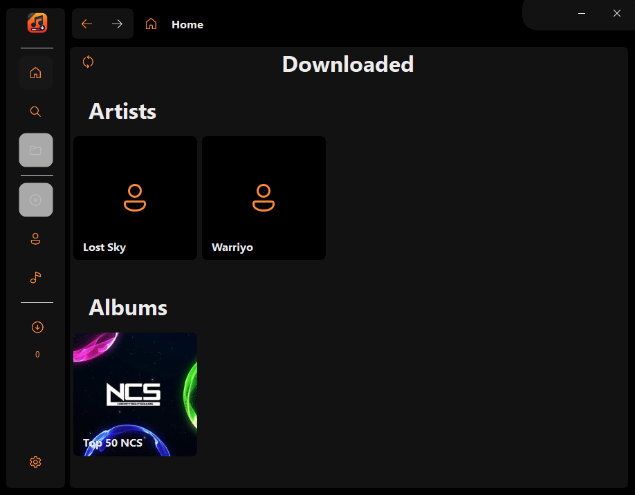
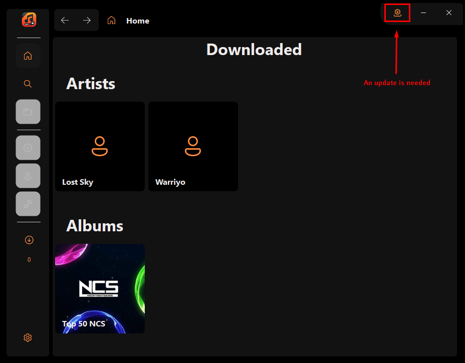

# FlacDownloader (latest update 11/23/2024)
This lightweight application allows you to download FLAC and MP3 files from an API.
It was created for educational purposes, which is why the URLs are not hardcoded in the code and must be configured in the settings.

# Table of contents
- Installation guide

# Installation guide

- [Download the lastest version]() - (check if some updates are needed)
- Unzip the archive somewhere on your computer
- Start `FlacDownloader.exe`
- Enjoy :smiley:

If an update is needed you will see the following button :

# Any suggestions ?

If you want to submit a new idea or you faced a bug :bug:, feel free to create a new issue by clicking on the `Issues` tab in the github repo.

# Creator :
Dev & Designer :
 - Pierre DUVEAU aka LINDRA

